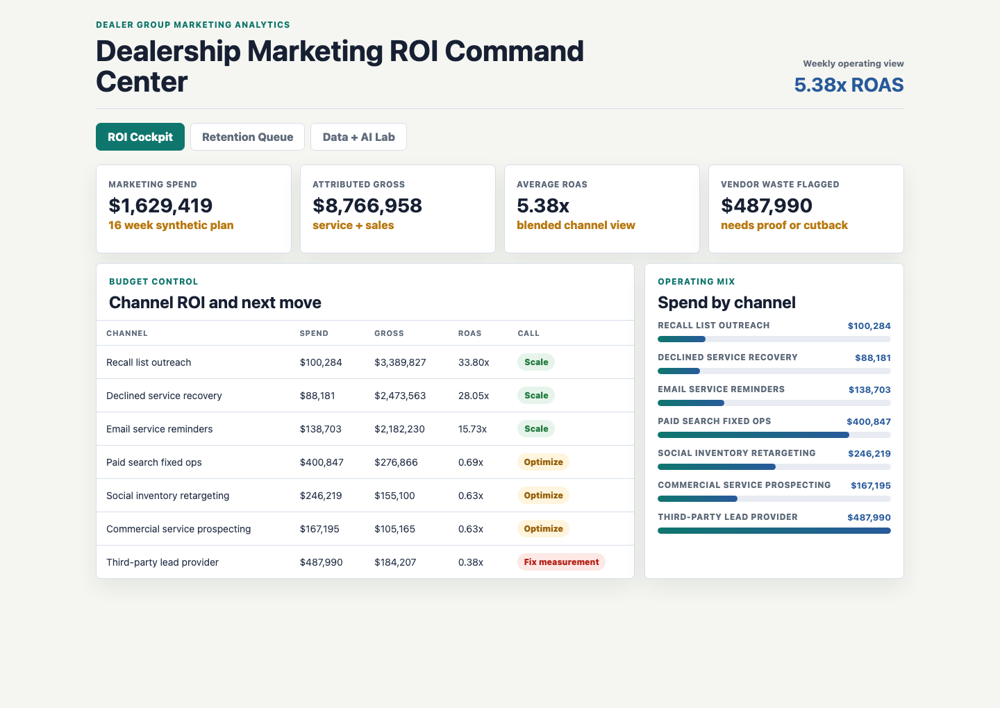
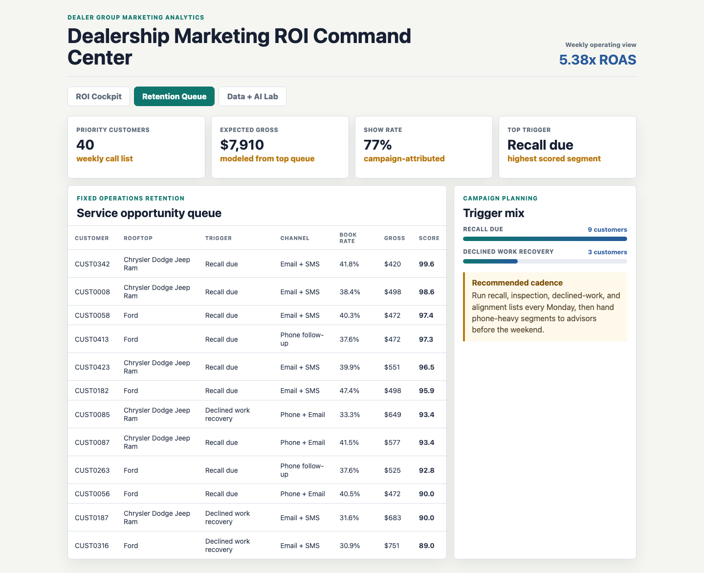
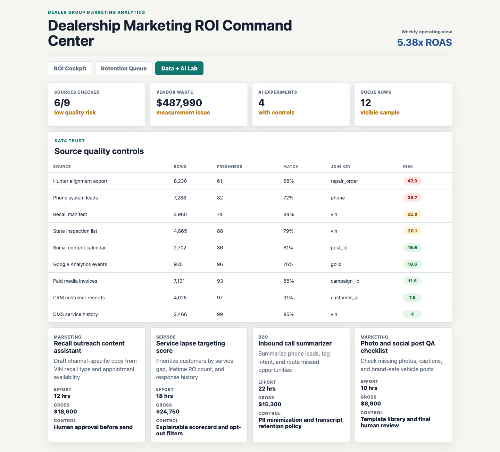

# Dealership Marketing ROI Command Center

This portfolio artifact models how a two-rooftop franchised automotive dealer group can use first-party data to improve marketing ROI, fill service lanes, reduce low-value vendor spend, and test practical AI workflows.

The project is built for a hands-on marketing analytics and technology role where the work spans campaign execution, fixed-ops retention, dashboard reporting, data quality, creative oversight, and AI experimentation.

## Screenshots



**ROI cockpit:** Summarizes spend, attributed gross, blended ROAS, vendor waste, and channel-level recommendations for a weekly leadership review.



**Retention queue:** Prioritizes service customers by recall status, state inspection timing, service lapse, declined work, Hunter alignment findings, expected gross, and best outreach channel.



**Data and AI lab:** Ranks source quality risks across CRM, DMS, recall, inspection, Hunter alignment, phone, web, paid media, and social sources, then frames controlled AI use cases.

## What This Demonstrates

- Marketing ROI reporting across email, SMS, phone, paid search, paid social, recall outreach, declined service recovery, commercial prospecting, and third-party lead providers.
- A transparent priority model for customer retention programs that a service manager can inspect and challenge.
- Source quality controls for dealership data that often lives across CRM, DMS, manufacturer feeds, website analytics, phone systems, spreadsheets, and vendor reports.
- AI ideas that are operationally realistic, with human approval, privacy, and measurement controls.

## Data

All data is synthetic and generated by `scripts/score_operating_data.py`. No real customer, VIN, phone, CRM, DMS, repair order, website, advertising, or dealership performance records are included.

The generator creates:

- `data/customers.csv`, 480 synthetic customer and vehicle records.
- `data/campaign_performance.csv`, 224 weekly rooftop and channel performance rows.
- `data/service_opportunities.csv`, customer-level retention triggers.
- `data/source_quality_checks.csv`, data freshness, match rate, join-key, and control checks.
- `data/ai_use_cases.csv`, practical AI experiments with effort, expected gross, risk, and controls.
- `analysis/outputs/dashboard_payload.json`, the app payload.

The synthetic structure is modeled on common dealership operating patterns: multiple rooftops, brand lines, service reminders, open recalls, state inspection windows, declined service, alignment findings, phone follow-up, paid media, social content, and third-party lead vendor spend.

## Analysis Outputs

- `analysis/outputs/channel_roi_summary.csv`
- `analysis/outputs/retention_priority_queue.csv`
- `analysis/outputs/data_quality_queue.csv`
- `analysis/outputs/summary.json`
- `analysis/executive_findings.md`
- `analysis/analysis_plan.md`
- `analysis/sql_checks.sql`

## Scope

This artifact does:

- Show how marketing, service, sales, parts, and leadership could share one weekly operating view.
- Convert source data into ranked campaign and retention decisions.
- Document synthetic data assumptions so the analysis can be explained in an interview.

This artifact does not:

- Claim to represent any real dealership performance.
- Connect to live CRM, DMS, OEM, Google Analytics, phone, or advertising systems.
- Replace incrementality testing, vendor contract review, or privacy review before production use.

## Run Locally

```bash
python3 scripts/score_operating_data.py
python3 -m http.server 4173
```

Then open `http://127.0.0.1:4173`.
